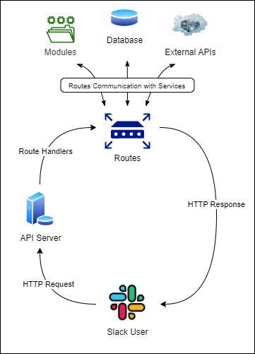

# Roberto the SlackBot

## Table of Contents
- [Roberto the SlackBot](#roberto-the-slackbot)
    - [Overview](#overview)
    - [Project Management Board](#project-management-board)
    - [Software Requirements](#software-requirements)
    - [Installation](#installation)
    - [Deployment](#deployment)
    - [Commands](#commands)
        - [Timer](#timer)
        - [Countdown](#countdown)
        - [DieRoll](#dieroll)
        - [CoinFlip](#coinflip)
    - [UML Data Model](#uml-data-model)
    - [Approach to Testing](#approach-to-testing)
    - [JSDocs](#jsdocs)
    - [Authors](#authors)
    - [Collaborations](#collaborations)
    - [License](#license)
    - [Acknowledgements / Resources](#acknowledgements-/-resources)

## Overview

## Project Management Board
This project utilizes GitHub Workflow / Projects boards. You can visit this board and see agile practices in action by clicking the link below.
[Workflow Board](https://github.com/orgs/401Mid/projects/1)


## Software Requirements
Please visit this link to view the [Software Requirements](./requirements.md)


## Installation
First clone down a copy of the repository from here [Repo Link](https://github.com/401Mid/project).

```bash
$ git clone https://github.com/401Mid/project/
```

Next move into project directory and install all required dependencies.

```bash
$ cd project/
$ npm install
```

Before we can get to running this application locally, you will need to create yourself a classic Slack Bot and assign it to your workspace. Please refer to the Slack API Documentation.
- [Slack API](https://api.slack.com/authentication/basics)

To see follow the steps we used to set up this bot checkout these set up instructions. This will go over creating a slack app, setting up initial scope, enabling listening events, and adding the appropriate slash commands required to run this project.
- [Bot Setup Instructions](./slackBotInstructions.md)

Once you have completed the initial creation of your slack app, we can move into assigning some environment variables. In this project we use `dotenv` library to hold these values. Start off by creating this file.

```bash
$ touch .env # Note the . before env as this is a hidden file
```

After it is created you will need to add the following key value pairs

```bash
BOT_USER_TOKEN: # This is the Bot User OAuth token provided to you after creating a new Slack App
SLACK_SIGNING_SECRET: # Slack Signing Secret provided to you after creating a new Slack App
PORT: # Port number that you wish to use when running locally
```

Almost there! You have completed the initial setup of this bot application, leading into deploying and using this bot.


## Deployment
These instructions will over how to deploy it locally utilizing `localhost` and a tunneling library called `ngrok`. In order for you to successfully run this bot locally you will need some way for outside users to access your `localhost` url. `ngrok` Exposes a local webserver to the internet. Please review the official documentation at the link below.
- [ngrok Documentation](https://ngrok.com/docs)

VSCode has several extensions that utilize ngrok and are quite intuitive. Our team used the following extension.
- [ngrok for VSCode](https://marketplace.visualstudio.com/items?itemName=philnash.ngrok-for-vscode) by philnash

Once you have set up ngrok to work with you, we can finally launch the bot! Lets start the application locally
```bash
$ npm start # Run from the root of your file
```
Set up ngrok to work on your the `PORT` you are running your server on. `Ngrok` will provide you an exposed web URL for use to hit your server. This URL will need to be added to your Slack App. There are two places this will need to be added:
- `Event Subscriptions`: Update the Request URL to match your `ngrok` exposed URL.
- `Slash Commands`: Each slash command will need the request url to match your `ngrok` exposed URL.

You are finally ready to see your bot in action! You can now travel over to your Slack Workspace where you have installed your bot and start using the built-in commands.


## Commands
These are the currently available slash commands for this bot application.
- `NOTE:` Ensure you have read through all the [Installation](#installation) instructions to make sure you have set up your Slack App to work with these commands.

### Timer
- Slash Command:
    - `/settimer`
- Description:
    - Set timer - helps to count time, the time starts count from the moment when user set it. Also user can set timer for someome else.
   - Optional parameter can be @username if user wants to set timer for another user.
- Example: These commands are executed within the Slack Workspace where the bot is installed.
  ```
       /settimer
       @kshydlovska  your timer is set.
       @someone,  @kshydlovska just started timer for you.
  ```
- Slash Command:
    - `/gettimer`
- Description:
    - Get timer - helps get current spent time whout stopping timer. Also any user can get current time for themself or someome else.
   - Optional parameter can be @username if user wants to get timer for another user.
- Example: These commands are executed within the Slack Workspace where the bot is installed.
  ```
       /gettimer
       @kshydlovska your current time is.
       @someone, your current time is.
  ```
- Slash Command:
    - `/stoptimer`
- Description:
   - Stop timer - stops timer and send response with time user spent
   - Optional parameter can be @username if user wants to stop timer for another user, but user can stop timer for another user ony if he set it. In case if user set timer for themself nobody else can't stop it.
- Example: These commands are executed within the Slack Workspace where the bot is installed.
  ```
       /stoptimer
       @kshydlovska spent (and actualy time spent).
       @someone spent (and actualy time spent).
       Sorry @kshyd you cannot perform this operation.
  ```


### Countdown
- Slash Command:
    - `/countdown`
- Description:
    - Prompts the user to enter the time they would like to set a countdown for, in HH:MM:SS format.
    - HH:MM:SS is converted to milliseconds behind the scenes and the Bot will alert the user when their input time ahas elapsed
    - If the user inputs an invalid time, the Bot will prompt the user to try again and remind the user of the format needed.
        - This command is executed within the Slack Workspace where the bot is installed:
        ```
        User: /countdown 00:01:30

        Bot: Setting countdown for 00:01:30 for [@username].

        ---after 1 minute, 30 seconds passes---

        Bot: [@username], your 00:01:30 is up!
        ```
        - Invalid Input Examples:
        ```
        User: /countdown 0:0:03
        // missing zeroes

        User: /countdown 00:60:00
        // 60 minutes or seconds should be rounded
        up to 01 hour or 01 minute respectively

        User: /countdown 00:30
        // missing HH or MM or SS

        Bot: Oops! It looks like you are trying to set a countdown, [@username].
        Try again, and please use HH:MM:SS format.
        For example: 00:30:00 will set a countdown for 30 minutes.
        ```


### DieRoll
- Slash Command:
    - `/dieroll`
- Description:
    - Simulates rolling a six die. The default functionality is rolling a six sided die once. The outcome is visualized by a die emoji.
    - Optional parameter include changing the number of sides a die has and the number of times the die is rolled.
- Example: These commands are executed within the Slack Workspace where the bot is installed.
    ```
        '/dieroll'
        The default die has possible outcomes between 1 and 6. This die is rolled once. The outcome is the value of the single number rolled.

        '/dieroll 8 10'
        The die now has possible outcomes between 1 and 8. This die is rolled 10 times. The outcome is the average of all rolls.
    ```


### CoinFlip
- Slash Command:
    - `/coinflip`
- Description:
    - Simulates flipping a two-sided coin. Heads or Tails. The outcome will state the number of coins flipped, and the percentage ratio of the win.
    - Optional parameter that can be passed in to indicate how many flips to occur.
- Example: These commands are executed within the Slack Workspace where the bot is installed.
    ```
        /coinflip
        A coin was flipped 1 time and the results were 100.0% HEADS.

        /coinflip 100
        A coin was flipped 50 times and the results were 56.0% TAILS.
    ```

## UML Data Model



## Approach to Testing
In this application we are utilizing a testing library called `jest`. We have automated unit and integration tests for the current state of this application.
- `NOTE:` Anything you change / add on this application may or may not break these tests and that is the risk you have to take.
Currently this application is configured to run the following command
```bash
$ npm test
# OR
$ npm watch
```


## JSDocs
Throughout our project we have utilized Docstrings and are using a third party library called `JSDocs`. This library will produce an browsable HTML file, that contains all the functions, classes, and methods that this application has to offer. To get these files you can execute the following script.

```bash
$ npm run build-documentation
```

This will create a `./public` folder within the root of the project. Inside you will find all the created HTML files from this project. You can now launch `index.html` from your favorite browser!

## Authors
- Software Developer: Cas Ibrahim
    - [Official Github](https://github.com/mamacas)
- Software Developer: Kateryna Shydlovska
    - [Official Github](https://github.com/KaterynaShydlovska)
- Software Developer: Joseph Zabaleta
    - [Official Github](https://github.com/joseph-zabaleta)
- Software Developer: Reagan Roberts
    - [Official Github](https://github.com/Rearo43)

## Collaborations
- none

## License
This project is under the [MIT License](./LICENSE).

## Acknowledgements / Resources
- [Bolt.js for SlackBots](https://github.com/slackapi/bolt-js)
- [ngrok documentation](https://ngrok.com/docs)
- [Ngrok for VSCode Extension](https://marketplace.visualstudio.com/items?itemName=philnash.ngrok-for-vscode)
- [Project WorkFlow](https://github.com/orgs/401Mid/projects/1)
- [Slack API](https://api.slack.com/authentication/basics)
- [Slack Bot Instructions](./slackBotInstructions.md)
- [Software Requirements](./requirements.md)
- [@use JSDocs](https://jsdoc.app/)
