# Creating a Slack Application (Classic)

## Table of Contents
- [Overview](#overview)
- [Create a Slack App (Classic)](#create-a-slack-app-classic)
- [Add features and functionality](#add-features-and-functionality)
- [Add Legacy Bot User](#add-legacy-bot-user)
- [Install App & Bot User OAuth Token](#install-app-&-bot-user-oauth-token)
- [Slack Signing Secret](#slack-signing-secret)
- [Event Subscriptions](#event-subscriptions)
    - [Subscribe to Bot Events](#subscribe-to-bot-events)
- [Configure Slash Commands](#configure-slash-commands)

## Overview
This guide will provide a step by step guide to creating an Slack App. As this guide is designed to get a Slack App up and running for this guide, please visit the official documentation to expand and better understand the creation of a Slack App.
- [Slack API](https://api.slack.com/authentication/basics)

## Getting Started
Lets create a Classic App using the following link:
- [Slack Create Classic App](https://api.slack.com/apps?new_classic_app=1)

## Create a Slack App (Classic)

This may prompted you to login to slack if you are not already logged in. Give your App a name and assign it to a Slack Workspace.
- `NOTE:` Notice the top of the creation box "Creat a Slack App (Classic)" You want to be creating a classic Slack app.

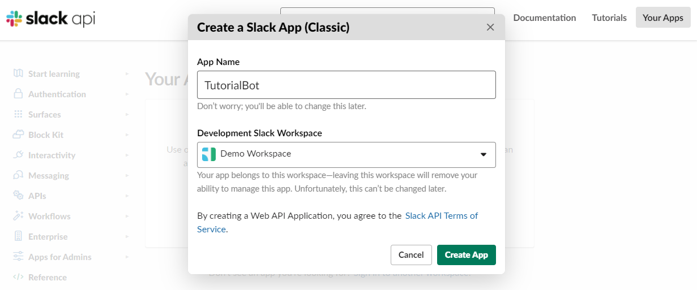

---

## Add features and functionality

This will bring you to the Basic Information of your App. We will need to Add Features and functionality. In this tutorial you will want to click on "Bots".

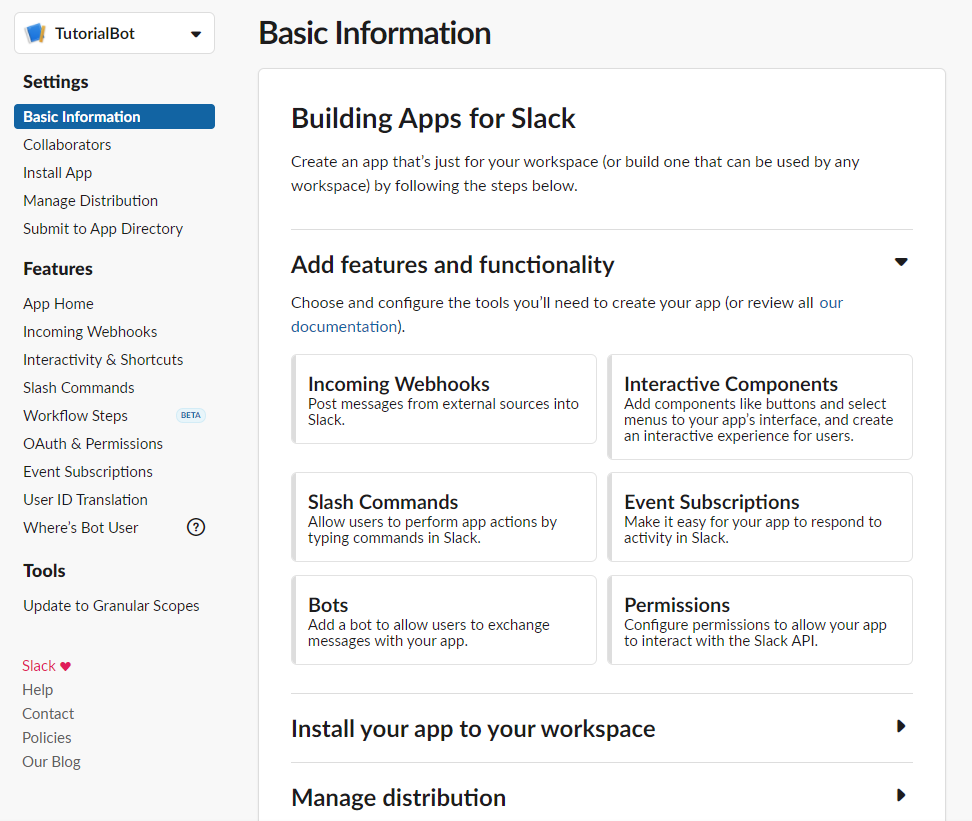

---

## Add Legacy Bot User

After selecting "Bots" feature and functionality you are redirected to "App Home". First thing to do here, is add a legacy bot user.

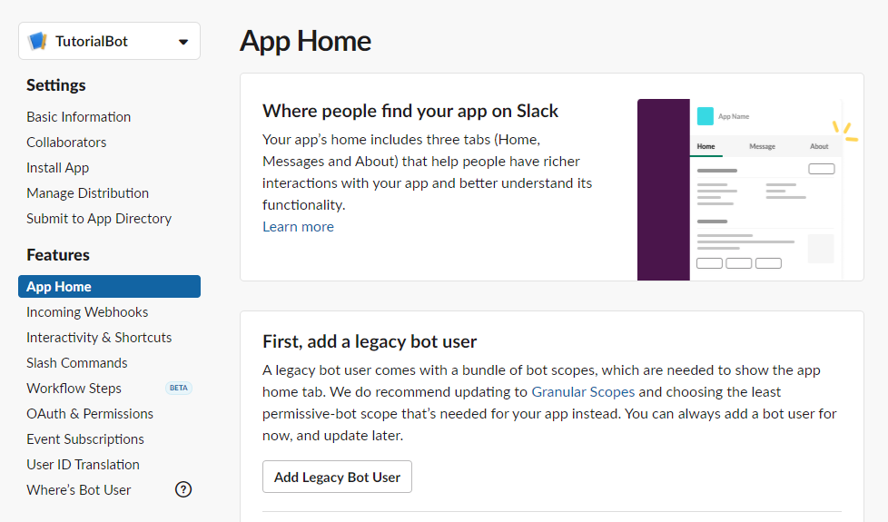

This is where you will set a display or bot name as well as a default username for your bot. I am using the same name as my Slack App to keep things simple.

---

## Install App & Bot User OAuth Token
Next we need to install our application within our workspace. This is also where you obtain your `Bot User OAuth Token` for your environment variables file. Save this token to your `.env` file.
- `NOTE:` KEEP THESE SECRET. These should be stored in `.env` file and not shared.

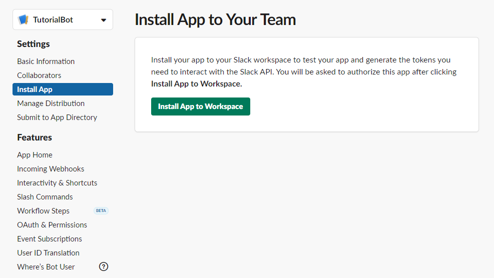

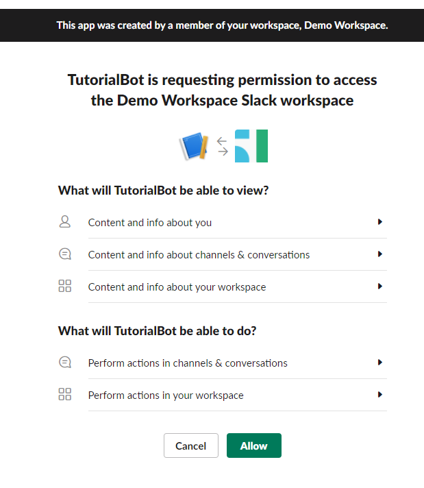

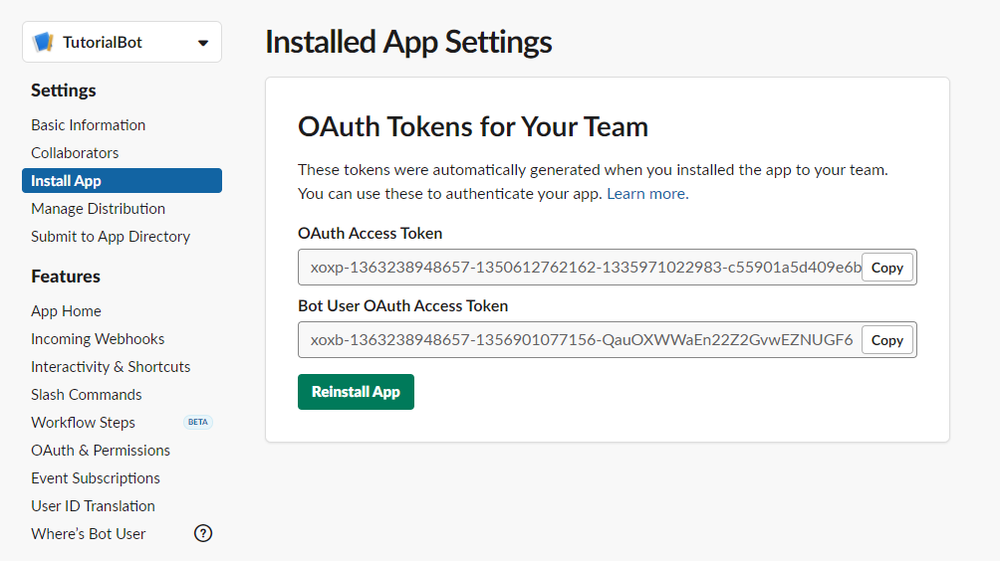

---

## Slack Signing Secret
The next secret you will require is the Signing Secret. Navigate to the Basic Information Tab of your App. Here you will find a section called "App Credentials". There you will obtain your `Signing Secret`.
- `NOTE:` KEEP THESE SECRET. These should be stored in `.env` file and not shared.

---

## Event Subscriptions
This will subscribe your bot to slack events to be notified of specified events. By default it is set to "off" so turn it "On". You will need to add a Request URL.
- `Request URL`: This is either your deployed version of this application URL OR This will be the link that `ngrok` service provides you when exposing `localhost` to the internet.

For this tutorial, I have added the `Bot User Oauth Token` and `Signing Secret` to my `.env` and I am running this application on `localhost`. I am using `ngrok` to create a exposed URL, using this VSCode extension [ngrok for VSCode](https://marketplace.visualstudio.com/items?itemName=philnash.ngrok-for-vscode). Once you obtain a proper Request URL it will be "Verified".
- `NOTE:` Our API will require you to append `/slack/events` to the end of your exposed URL.

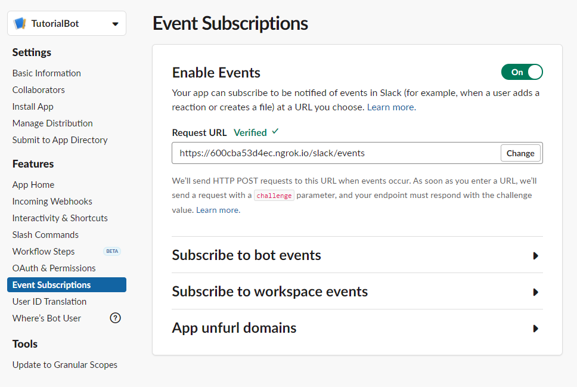

### Subscribe to Bot events
Inside th Event Subscriptions, you have additional features you can add. For this bot implementation we will need to subscribe to four events:
- `message.im`: A message was posted in a direct message channel. Allows the bot to react to direct messages.
- `message.groups`: A message was posted to a private channel. Allows the bot to interact with group chats.
- `message.channels`: A message was posted to a channel. Allows the bot to listen to channels.
- `message.mpim`: A message was posted in a multiparty direct message channel. Allows bot to work for group direct messages.

Simply click "Add Bot User Event" and search for these four to add. Make sure you click save!
- `NOTE:` Keep this request URL handy as you will need this to configure the built-in slash commands for this bot.

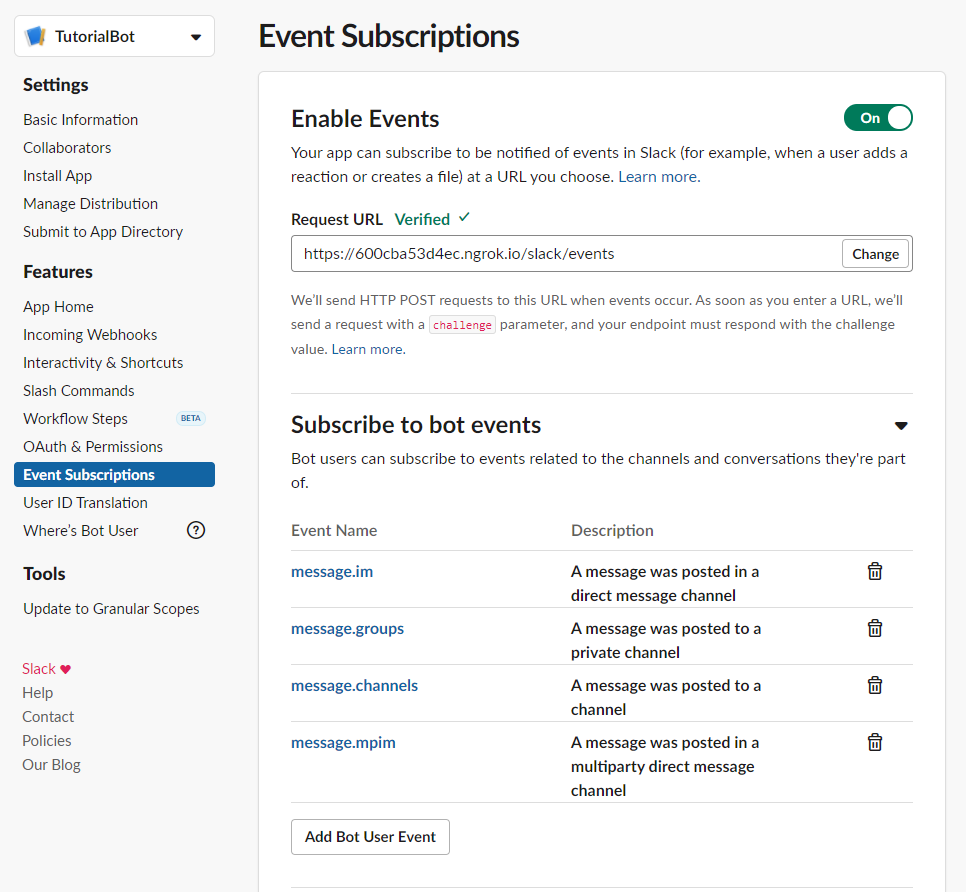

---

## Configure Slash Commands
This part is to configure the slash commands to be working with this source code. Navigate to the "Slash Commands" tab and "Create New Command"
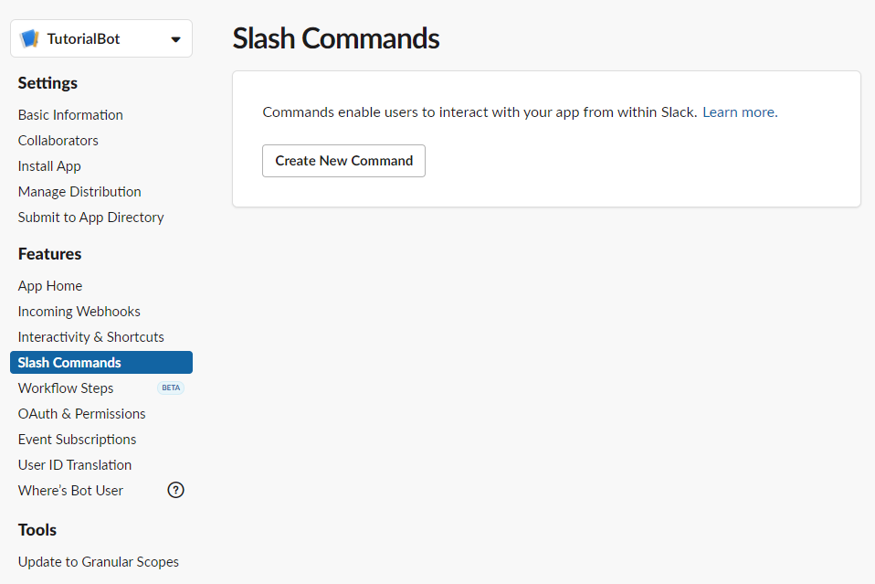

This is an example of how to setup the `/coinflip` command. Please refer to the [Official README.md](./README.md) for complete list of slash commands to be added here. There are four fields to fill out:
- `Command`: This is the name of the command, which should also match the route on `app.js` within the code.
- `Request URL`: This is the exposed `Localhost` or deployed URL of your bot.
    - `NOTE:` This is the same link from Event Subscriptions, and should also have the appened `/slack/events`
- `Short Description`: Add a description for your users to see.
- `Usage Hint`: Optional but there if you want one.

Once complete make sure you click save.

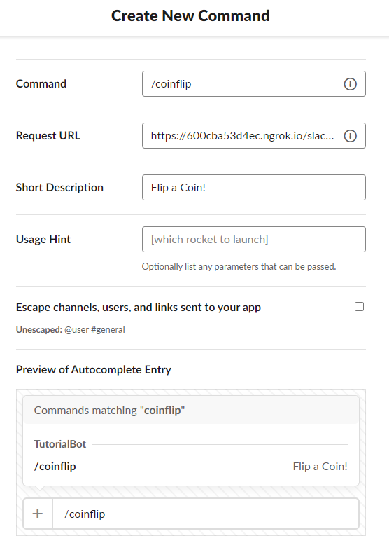

Oops! Yellow banner! Ah we made some big changes to our Slack App and it requires us to Reinstall our Slack App for changes to take effect. Head over to the "Install App" tab and Click "Reinstall".

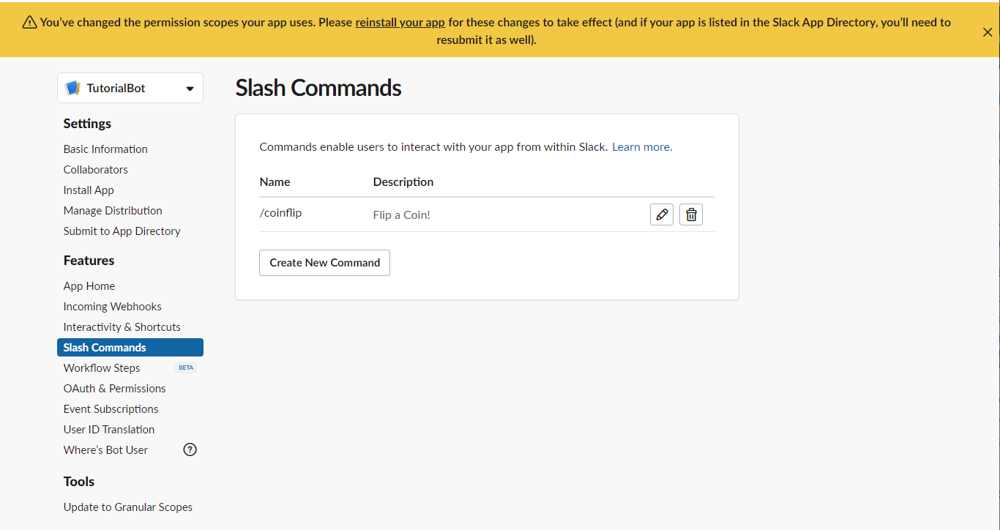

